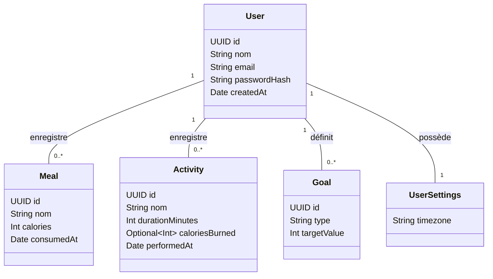

# Diagramme de classes — ZakFit

```mermaid
classDiagram
    direction TB

    class User {
        UUID id
        String nom
        String email
        String passwordHash
        Date createdAt
    }

    class Meal {
        UUID id
        String nom
        Int calories
        Date consumedAt
    }

    class Activity {
        UUID id
        String nom
        Int durationMinutes
        Optional~Int~ caloriesBurned
        Date performedAt
    }

    class Goal {
        UUID id
        String type
        Int targetValue
    }

    class UserSettings {
        String timezone
    }

    User "1" -- "0..*" Meal : enregistre
    User "1" -- "0..*" Activity : enregistre
    User "1" -- "0..*" Goal : définit
    User "1" -- "1" UserSettings : possède
```

Le tableau de bord calcule ses totaux à partir des repas et des activités.
Il utilise le fuseau horaire des paramètres pour délimiter chaque journée.
